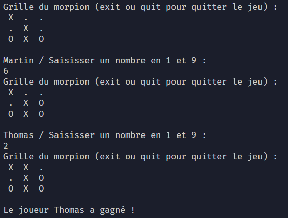

# Mini projet : Le morpion

## Règles du jeu

- Deux joueurs
- Chaque joueur joue à tour de rôle.
- Si tu arrives à faire une ligne de trois de tes symboles, tu as gagné.
- Si tu arrives à faire une colonne de trois de tes symboles, tu as gagné.
- Si tu arrives à faire une diagonale de trois de tes symboles, tu as gagné.
- Si toutes les cases sont remplies et que personne n'a réussi à faire une ligne, une colonne ou une diagonale, il y a match nul.

---

## Rules

- Two players
- Each player takes turns playing.
- If you manage to make a line of three of your symbols, you win.
- If you manage to make a column of three of your symbols, you win.
- If you manage to make a diagonal of three of your symbols, you win.
- If all the spaces are filled and no one has managed to make a line, a column, or a diagonal, it is a draw.
